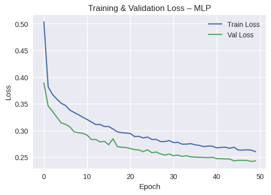
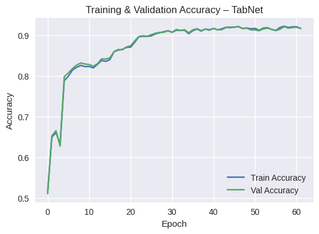
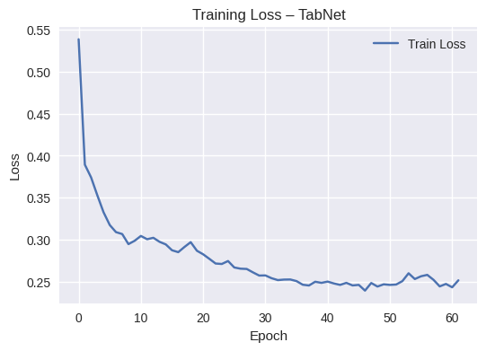
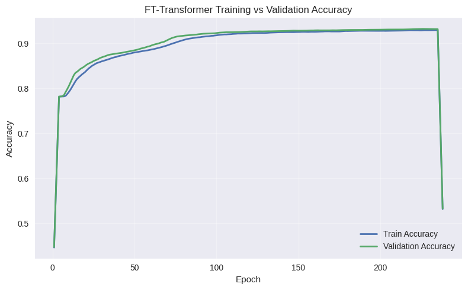
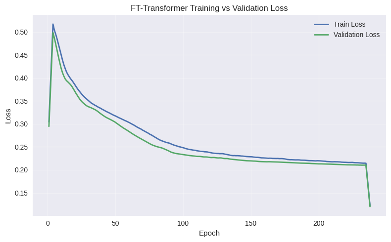

# Sistem Prediksi Risiko Kredit Nasabah Menggunakan Neural Network dan Transfer Learning pada Data Tabular

## Deskripsi Proyek

Proyek ini merupakan implementasi sistem prediksi risiko kredit (Credit Risk Prediction) berbasis Machine Learning untuk data tabular. Sistem ini bertujuan untuk memprediksi kemungkinan default pinjaman berdasarkan karakteristik demografis dan finansial peminjam.

Dalam proyek ini, diimplementasikan tiga model neural network sesuai dengan ketentuan modul, yaitu:

- Neural Network Base (Non-Pretrained)
  Model Multilayer Perceptron (MLP) yang dibangun dan dilatih dari awal tanpa menggunakan bobot pretrained. Model ini digunakan sebagai baseline untuk data tabular.

- Model Pretrained 1 – TabNet
  Model deep learning khusus data tabular yang menggunakan mekanisme attention dan feature selection, diadaptasi sebagai pendekatan transfer learning untuk meningkatkan performa prediksi.

- Model Pretrained 2 – FT-Transformer
  Model berbasis Transformer untuk data tabular yang memanfaatkan self-attention guna menangkap hubungan kompleks antar fitur, digunakan sebagai model pretrained kedua dalam skema transfer learning.

Proyek ini mencakup seluruh tahapan pipeline Machine Learning, mulai dari preprocessing data, pelatihan model, hingga evaluasi performa. Evaluasi dilakukan secara komprehensif menggunakan classification report (accuracy, precision, recall, dan F1-score), confusion matrix, serta grafik training dan validation loss serta accuracy untuk menganalisis performa dan potensi overfitting pada setiap model.

Sebagai tahap akhir, seluruh model yang telah dilatih diintegrasikan ke dalam aplikasi web berbasis Streamlit, sehingga pengguna dapat melakukan prediksi risiko kredit secara interaktif melalui antarmuka website yang dijalankan secara lokal.

## Tujuan proyek:

- Membangun pipeline *training → evaluasi* secara end-to-end
- Membandingkan performa beberapa model *Machine Learning*
- Menyajikan hasil prediksi dalam bentuk sistem website yang dapat dijalankan secara lokal

## Struktur Repository
```
UAP/
│
├── .venv/
├── .pdm-python
├── pdm.lock
├── pyproject.toml
├── .gitignore
├── credit_risk_dataset.csv
├── get-pip.py
├── src/
│   ├── frhn_UAP_TrainModel.ipynb   (NOTEBOOK TRAINING)
│   └── project-uas/
│       │
│       ├── Prediction.py         
│       ├── assets/
│       │   └── style.css/
│       │
│       ├── models/
│       │   ├── mlp_model/
│       │   ├── tabnet_model/
│       │   └── ft_transformer_model/
│       │
│       ├── pages/
│       │   ├── Batch_Prediction.py
│       │   ├── FT_Transformer.py
│       │   ├── MLP.py
│       │   └── TabNet.py
│       │
│       ├── services/
│       │   ├── mlp_service.py
│       │   ├── tabnet_service.py
│       │   └── ft_transformer_service.py
│       │
│       └── utils/
│           ├── load_css.py
```

## Dataset

Dataset berhasil dimuat dengan detail sebagai berikut:

- Jumlah data : 32.581 baris
- Jumlah fitur : 12 kolom
- Ukuran memori: 1763 KB

Daftar Fitur : 
Fitur Numerik (7)
- person_age
- person_income
- person_emp_length
- loan_amnt
- loan_int_rate
- loan_percent_income
- cb_person_cred_hist_length

Fitur Kategorikal (4)
- person_home_ownership
- loan_intent
- loan_grade
- cb_person_default_on_file

Target : 
- loan_status

Definisi Target: 
0 → Resiko Rendah (Lancar Bayar)
1 → Resiko Tinggi (Gagal Bayar)

## Preprocessing Data

### Pemisahan Data

Data dibagi menggunakan stratified split untuk menjaga proporsi kelas target:
Split	      Jumlah Data
Train	        22.806
Validation	   4.887
Test	         4.888

### Preprocessing MLP
- Numerical: Median Imputation + StandardScaler
- Categorical: Most Frequent Imputation + Ordinal Encoding
Digunakan pipeline ColumnTransformer untuk konsistensi training & inference.

### Preprocessing Tabnet
- Numerical: Median Imputation
- Categorical: Ordinal Encoding
Tanpa scaling numerik karena TabNet mampu menangani skala fitur secara internal.

### Preprocessing FT-Transformer
- Numerical: Median Imputation + StandardScaler
- Categorical: Label Encoding
Encoding disimpan untuk keperluan inference

## Model yang Digunakan
Proyek ini menggunakan tiga model Machine Learning yang diimplementasikan dan dilatih secara terpisah, dengan tujuan membandingkan performa model baseline dan model deep learning lanjutan pada data tabular.

### Multi-Layer Perceptron (MLP)
Model Multi-Layer Perceptron (MLP) digunakan sebagai baseline deep learning untuk data tabular.
Model ini diimplementasikan menggunakan TensorFlow/Keras dengan arsitektur fully-connected neural network.

#### Arsitektur Model
Model terdiri dari beberapa hidden layer dengan aktivasi ReLU dan regularisasi sebagai berikut:
- Input layer sesuai jumlah fitur hasil preprocessing
- Dense (128) + ReLU
- Batch Normalization
- Dropout (0.3)
- Dense (64) + ReLU
- Batch Normalization
- Dropout (0.3)
- Dense (32) + ReLU
- Dropout (0.2)
- Output layer Dense (1) dengan aktivasi Sigmoid

Arsitektur ini dirancang untuk:
- Menangani non-linearitas data
- Mengurangi risiko overfitting melalui Dropout dan Batch Normalization
- Konfigurasi Training
- Loss function: Binary Crossentropy
- Optimizer: Adam (learning rate = 1e-3)
- Metrics: Accuracy dan AUC
- Batch size: 256
- Epoch maksimum: 50

Untuk mencegah overfitting, digunakan:
- EarlyStopping dengan monitoring val_loss (patience = 5)
- ModelCheckpoint untuk menyimpan model terbaik berdasarkan val_auc

### TabNet
Model TabNet digunakan sebagai model deep learning yang secara khusus dirancang untuk data tabular.
TabNet memanfaatkan mekanisme sequential attention untuk melakukan feature selection secara eksplisit pada setiap decision step.

#### Konfigurasi Model
Model diimplementasikan menggunakan library pytorch-tabnet dengan konfigurasi utama:
- Decision dimension (n_d) = 16
- Attention dimension (n_a) = 16
- Number of steps (n_steps) = 5
- Sparse regularization (lambda_sparse) = 1e-4
- Mask type: entmax (sparse attention)

Optimizer dan scheduler:
- Optimizer: Adam (learning rate = 2e-2)
- Learning rate scheduler: StepLR (step size = 10, gamma = 0.9)

#### Training Strategy
- Data dikonversi ke tipe float32
- Training dilakukan hingga maksimum 100 epoch
- Early stopping diterapkan dengan patience = 15
- Evaluasi dilakukan pada data train dan validation set menggunakan accuracy

TabNet dipilih karena kemampuannya:
- Menangani fitur numerik dan kategorikal secara efisien
- Memberikan performa yang baik tanpa scaling numerik eksplisit
- Memiliki interpretabilitas melalui attention mask

### FT-Transformer
Model FT-Transformer merupakan model berbasis Transformer architecture yang dirancang khusus untuk data tabular. Model ini digunakan sebagai model paling kompleks dalam proyek ini.

#### Representasi Data
- Fitur numerik diproses sebagai continuous features
- Fitur kategorikal direpresentasikan menggunakan embedding berdasarkan cardinality masing-masing fitur
- Seluruh data dikonversi ke PyTorch tensor
- Training dilakukan pada CPU atau GPU (jika tersedia)

#### Arsitektur Model
Model diimplementasikan menggunakan library rtdl-revisiting-models dengan konfigurasi:
- Jumlah fitur numerik sesuai dataset
- Embedding untuk fitur kategorikal berdasarkan cardinality
- Dimensi blok (d_block) = 32
- Jumlah blok Transformer (n_blocks) = 4
- Jumlah attention heads = 8
- Dropout pada attention, feed-forward, dan residual connection
- Output layer disesuaikan dengan jumlah kelas target (loan_status).

#### Konfigurasi Training
- Loss function: CrossEntropyLoss
- Optimizer: AdamW (learning rate = 1e-3, weight decay = 1e-5)
- Early stopping manual dengan patience = 7 berdasarkan validation loss
- Model terbaik disimpan berdasarkan validation loss terendah

FT-Transformer dipilih karena kemampuannya:
- Menangkap interaksi kompleks antar fitur
- Memberikan performa tinggi pada data tabular kompleks
- Menjadi pembanding utama terhadap MLP dan TabNet

## Hasil Evaluasi Model (test set)
### MLP (Multi-Layer Perceptron)
Accuracy: 0.91
| Class | Precision | Recall | F1-Score |
|-------|-----------|--------|----------|
|   0   |   0.91    |  0.98  |   0.95   |
|   1   |   0.91    |  0.67  |   0.77   |


Plot Evaluasi:



#### Analisis Evaluasi Model MLP
Model MLP menunjukkan performa yang cukup solid dengan accuracy sebesar 0.91. Model ini sangat baik dalam mengklasifikasikan kelas No Default (kelas 0), tercermin dari nilai recall yang tinggi (0.98), artinya hampir seluruh peminjam yang tidak gagal bayar berhasil terdeteksi dengan benar. Namun, performa pada kelas Default(kelas 1) masih terbatas, khususnya pada recall (0.67), yang mengindikasikan bahwa sebagian kasus gagal bayar masih salah diklasifikasikan sebagai No Default (lancar bayar). 

### TabNet
Accuracy: 0.92
| Class | Precision | Recall | F1-Score |
|-------|-----------|--------|----------|
|   0   |   0.92    |  0.99  |   0.95   |
|   1   |   0.95    |  0.68  |   0.79   |

Plot Evaluasi:



#### Analisis Evaluasi Model TabNet
TabNet memberikan peningkatan performa dibandingkan MLP dengan accuracy 0.92. Model ini mempertahankan performa yang sangat baik pada kelas No Default (recall 0.99) sekaligus meningkatkan precision pada kelas Default hingga 0.95. Artinya, ketika TabNet memprediksi Default, prediksi tersebut lebih dapat dipercaya. Namun, recall kelas Default masih berada di angka 0.68, yang menunjukkan bahwa meskipun prediksi lebih presisi, sebagian kasus gagal bayar masih belum sepenuhnya terdeteksi.

### FT-Transformer

Accuracy: 0.93
ROC-AUC: 0.92
| Class | Precision | Recall | F1-Score |
|-------|-----------|--------|----------|
|   0   |   0.92    |  0.99  |   0.95   |
|   1   |   0.96    |  0.71  |   0.82   |

Plot Evaluasi:



#### Analisis Evaluasi Model FT-Transformer
FT-Transformer merupakan model dengan performa terbaik di antara ketiga model yang diuji. Model ini mencapai accuracy tertinggi (0.93) serta ROC-AUC sebesar 0.92, yang menandakan kemampuan diskriminatif yang sangat baik antara kelas Default dan No Default. Precision untuk kelas Default mencapai 0.96, sementara recall meningkat menjadi 0.71, menghasilkan F1-score tertinggi (0.82) untuk kelas default.